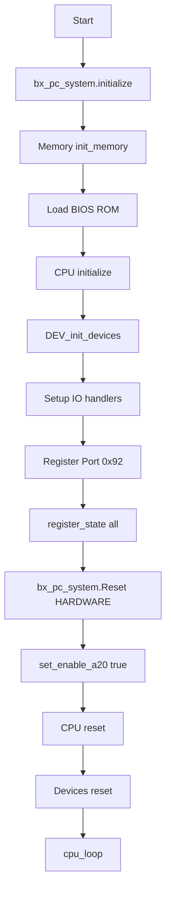

# Implement Bochs Hardware Initialization Sequence

This plan implements the initialization logic from `main.cc:1300-1363` following the analysis in `BOCHS_DEVICE_INITIALIZATION_ANALYSIS.md`.

## Current State Analysis

**Already implemented:**

- CPU: `initialize()`, `reset()`, `cpu_loop()` in [`src/cpu/init.rs`](rusty_box/src/cpu/init.rs)
- Memory: `init_memory()`, `load_ROM()` in [`src/memory/misc_mem.rs`](rusty_box/src/memory/misc_mem.rs)
- PC System: Basic structure with `reset()` in [`src/pc_system.rs`](rusty_box/src/pc_system.rs) (incomplete)
- Devices: Stub methods in [`src/iodev/devices.rs`](rusty_box/src/iodev/devices.rs)

**Needs implementation:**

- PC system `initialize(ips)` method
- PC system A20 line control (`set_enable_a20`)
- Enhanced `BxDevicesC::init()` with I/O port handler infrastructure
- I/O port read/write handlers
- `register_state()` methods for state save/restore
- Proper reset flow for devices

## Implementation Tasks

### 1. Enhance PC System (`src/pc_system.rs`)

Add:

- `initialize(ips: u32)` method - timer array setup, IPS configuration
- `set_enable_a20(value: bool)` - A20 line mask control
- `register_state()` - state registration for save/restore
- Timer fields for null timer and timer array
- `start_timers()` method

### 2. Enhance Device System (`src/iodev/mod.rs` and `src/iodev/devices.rs`)

Add:

- I/O port handler arrays (65536 ports)
- `register_io_read_handler()` / `register_io_write_handler()`
- `inp()` / `outp()` methods for port I/O
- Port 0x92 handler (System Control Port - A20 line enable, soft reset)
- Default I/O handlers that return 0xFF

### 3. Update Reset Flow

Modify `BxPcSystemC::reset()` to:

- Call `set_enable_a20(true)` first
- Reset CPU
- Reset devices (hardware reset only)

### 4. Create Initialization Example

Create [`examples/hardware_init.rs`](rusty_box/examples/hardware_init.rs):

```rust
// Demonstrates full initialization sequence:
// 1. bx_pc_system.initialize(ips)
// 2. Memory init + ROM loading
// 3. CPU initialize
// 4. DEV_init_devices()
// 5. register_state() for all components  
// 6. bx_pc_system.Reset(HARDWARE)
// 7. cpu_loop()
```


## Initialization Flow (per analysis doc)

