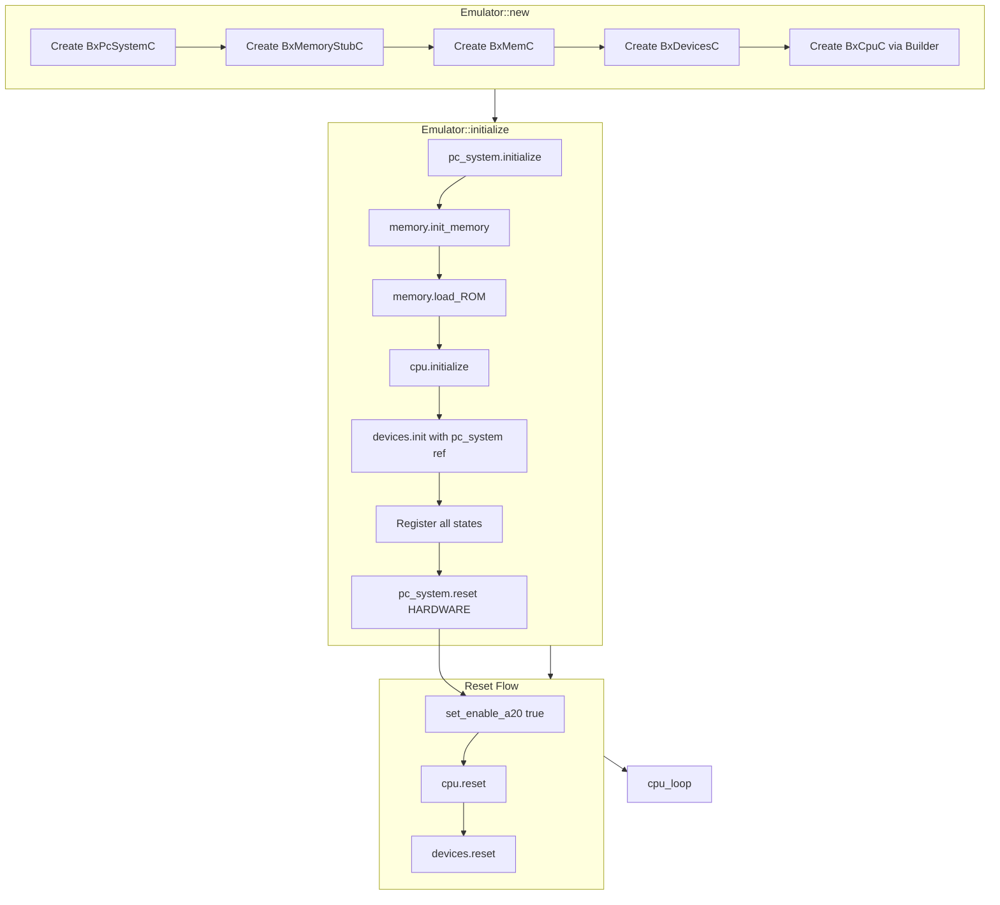

# Instance-Based Hardware Initialization

This plan implements the initialization logic from `main.cc:1300-1363` with a key architectural change: **remove all global statics** to allow hundreds of independent emulator instances.

## Critical Issue: Global State

Current [`src/pc_system.rs`](rusty_box/src/pc_system.rs) uses global statics:

```rust
static BX_PC_SYSTEM_LOCK: OnceLock<PcCell> = OnceLock::new();
```

This prevents running multiple independent emulator instances. All components must be instance-owned.

## Architecture: Emulator Instance

Create an `Emulator` struct that owns all components:

```rust
pub struct Emulator<I: BxCpuIdTrait> {
    pub cpu: BxCpuC<I>,
    pub memory: BxMemC,
    pub devices: BxDevicesC,
    pub pc_system: BxPcSystemC,
}
```

Each `Emulator` instance is fully independent - no shared state between instances.

## Implementation Tasks

### 1. Refactor PC System (Remove Global Static)

Modify [`src/pc_system.rs`](rusty_box/src/pc_system.rs):
- Remove `static BX_PC_SYSTEM_LOCK` and global accessor functions
- Make `BxPcSystemC` a normal struct that is instantiated per-emulator
- Add `new()`, `initialize(ips)`, `set_enable_a20()`, `start_timers()`
- Add `register_state()` for save/restore support
- Timer array for scheduling events

### 2. Refactor Device System (Instance-Based)

Modify [`src/iodev/mod.rs`](rusty_box/src/iodev/mod.rs) and [`src/iodev/devices.rs`](rusty_box/src/iodev/devices.rs):
- I/O port handler arrays (65536 read + 65536 write handlers)
- `register_io_read_handler()` / `register_io_write_handler()`
- `inp(port, len)` / `outp(port, value, len)` for port I/O
- Port 0x92 handler (A20 line control, soft reset)
- Reference to `BxPcSystemC` for A20 control (passed during init)

### 3. Create Emulator Container

Create [`src/emulator.rs`](rusty_box/src/emulator.rs):
- `Emulator<I>` struct owning CPU, Memory, Devices, PcSystem
- `Emulator::new(config)` - creates all components
- `Emulator::initialize()` - runs full init sequence
- `Emulator::reset(reset_type)` - coordinated reset
- `Emulator::run()` - enters CPU loop

### 4. Update CPU to Accept PC System Reference

Modify [`src/cpu/init.rs`](rusty_box/src/cpu/init.rs):
- `reset()` should work with instance-based PC system
- Remove any global `bx_pc_system()` calls

### 5. Update Memory A20 Handling

Modify [`src/memory/misc_mem.rs`](rusty_box/src/memory/misc_mem.rs):
- `a20_addr()` should use the emulator's PC system instance, not global
- Pass A20 mask from PC system during memory operations

### 6. Create Example with Multiple Instances

Create [`examples/multi_instance.rs`](rusty_box/examples/multi_instance.rs):

```rust
// Spawn 10 independent emulator instances in parallel threads
let handles: Vec<_> = (0..10).map(|id| {
    std::thread::spawn(move || {
        let mut emu = Emulator::<Corei7SkylakeX>::new(config)?;
        emu.initialize()?;
        emu.run()
    })
}).collect();
```

## Initialization Flow



## Files to Modify/Create

| File | Action | Changes |
|------|--------|---------|
| [`src/pc_system.rs`](rusty_box/src/pc_system.rs) | Modify | Remove global static, add initialize/A20/timers |
| [`src/iodev/mod.rs`](rusty_box/src/iodev/mod.rs) | Modify | I/O handler types, port arrays |
| [`src/iodev/devices.rs`](rusty_box/src/iodev/devices.rs) | Modify | Full init, inp/outp, Port 92h |
| [`src/emulator.rs`](rusty_box/src/emulator.rs) | Create | Emulator container struct |
| [`src/lib.rs`](rusty_box/src/lib.rs) | Modify | Export emulator module |
| [`src/memory/misc_mem.rs`](rusty_box/src/memory/misc_mem.rs) | Modify | Instance-based A20 handling |
| [`examples/multi_instance.rs`](rusty_box/examples/multi_instance.rs) | Create | Multi-instance demo |

## Thread Safety Model

- Each `Emulator` instance is **Send** (can move between threads)
- No shared mutable state between instances
- Internal thread safety not required (single-threaded per instance)
- Multiple instances can run in parallel on different threads